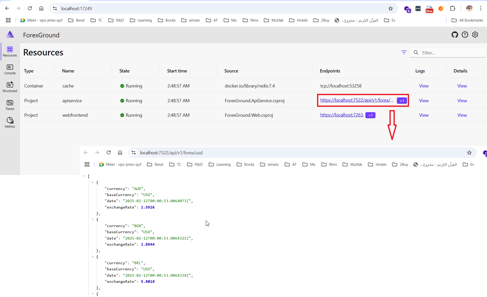
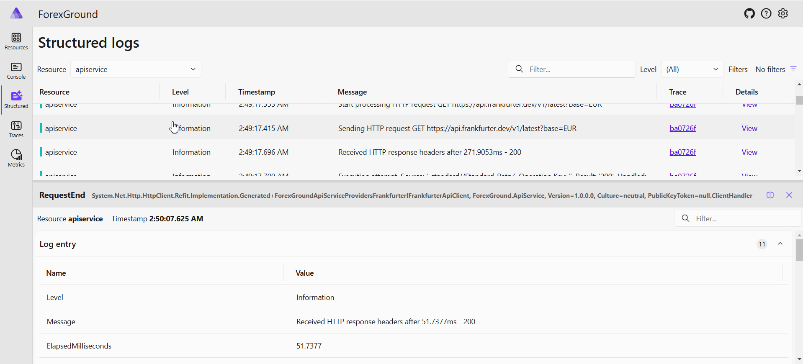
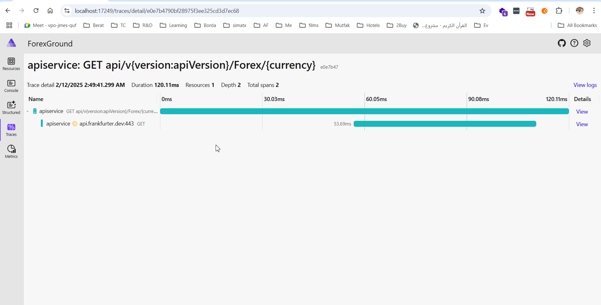
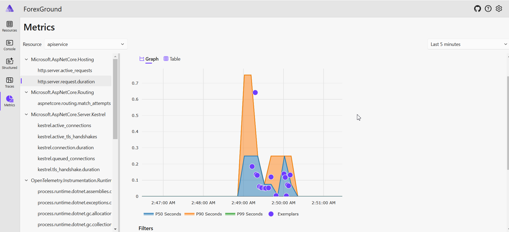

# ForexGround

## Running the project
Just click on F5, then you can use `app.http` to test the API. Also, you can click on the link of
`ForexGround.ApiService.csproj` to call `/forex/usd` api request.

## APIs
All APIs require authentication except the `/forex/{currency}` for testing purposes.
To get a valid token, you can use the `/login/token`. You should provide a valid username, password and role. 
Username and Password must be the same. The role must be `Agent`.

### Resilience, Retry Policy and Circuit Breaker
We use the Polly library to implement the resilience and retry policy.

### Caching
We use OutputCache to cache the response of all the endpoints for 5 minutes.

### Rate Limiting
We did not implement rate limiting (API throughtling) for the API. We can easily use the AspNetCoreRateLimit library to implement rate limiting.
However, the proper way to implement rate limiting is to use a side-concern service like Load Balancer or API Gateway.

### Logging Middleware
We use `RequestLoggingMiddleware` to intercept the request and log it. Of course, we can persist the log to a database or a file,
however, for now, we just log it to the console.

We did not use Serilog, however, it is matter of configuration. Not a big deal.

[image](./docs/middleware-log.png)

## Testing
We only create a simple Integration Test for the `GET /api/forex` endpoint.
We can add more tests for the other endpoints, but this requires more time.
Though, this is not a big deal. It is kind of straightforward.

Also, I did not provide Unit tests for any class because it is simple task that just consumes time. Sorry for that.

### OpenTelemetry
The application already uses OpenTelemetry to trace the requests.
So, it is already ready to integrate with Jaeger, Zipkin, Grafana, Prometheus, Tempo, Loki..etc.
All stuff, metrics, logs, and traces can be collected and visualized in one place.

Eventhough, the application uses a simple dashboard to visualize the traces and display logs. The following images are examples:

